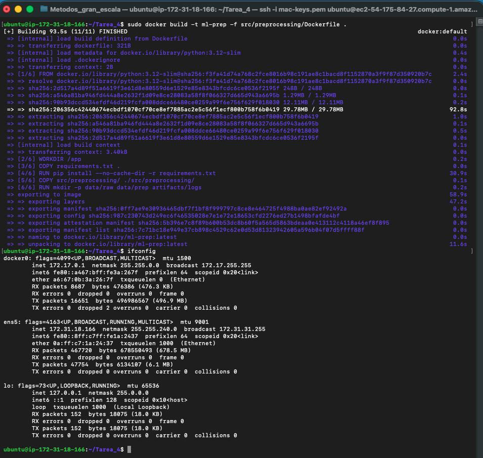
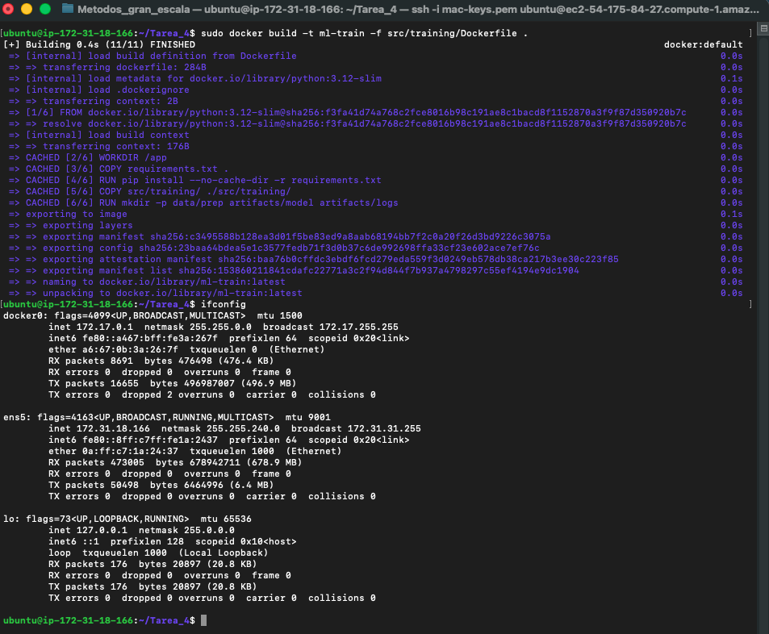
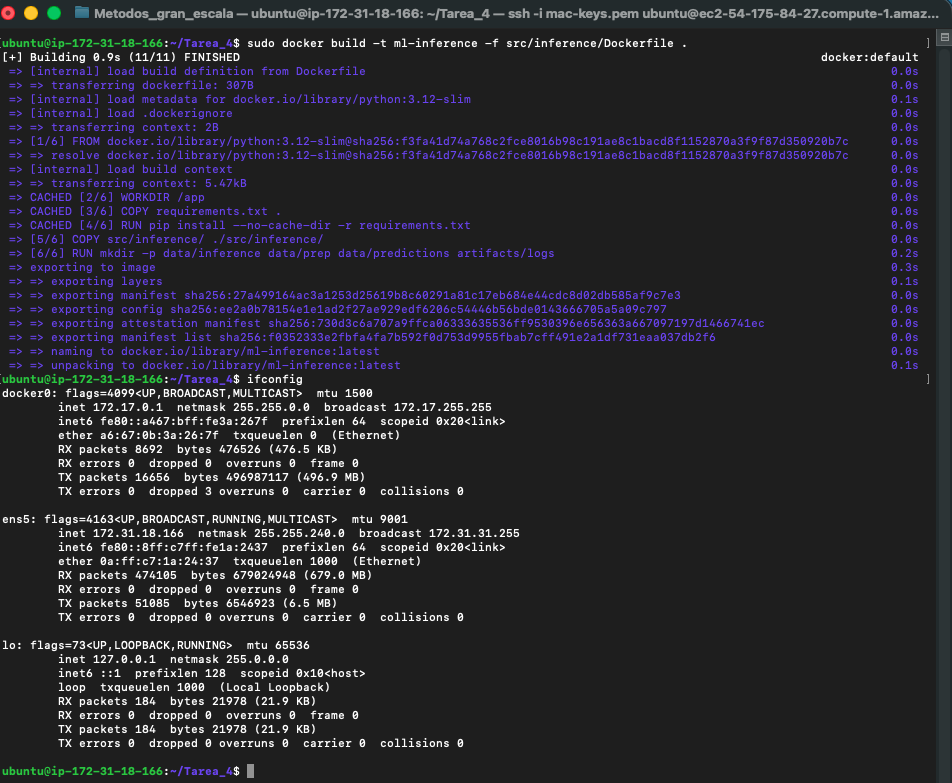
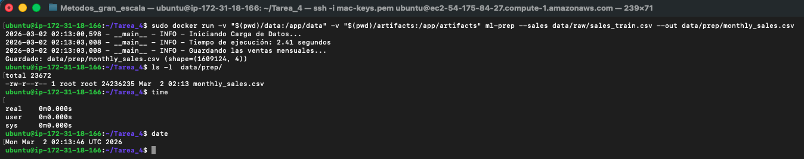
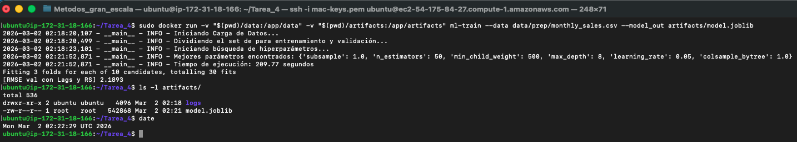
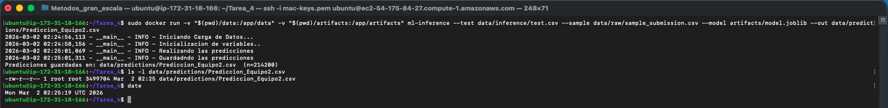
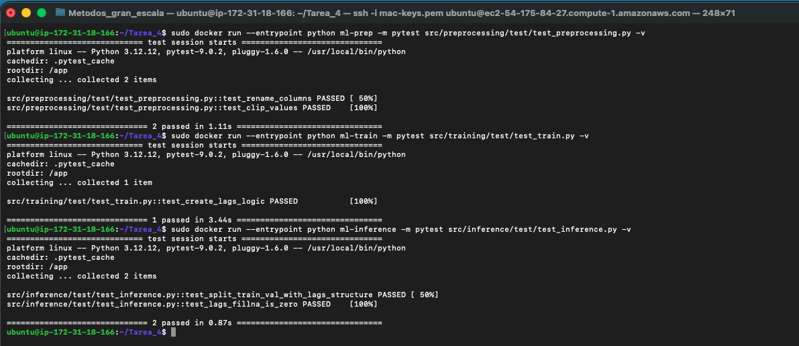

# Tarea 04: MLOps en Práctica — Docker, Git Workflow y Testing
## Diana Arroyo / Luis Cuadros

## Descripción del proyecto
Este repositorio contiene un pipeline end-to-end de Machine Learning para pronosticar demanda/ventas mensuales a nivel tienda–producto, desarrollado para 1C Company, una firma de software con operación retail a gran escala. El objetivo del proyecto es mejorar la planeación de inventarios y la toma de decisiones operativas mediante predicciones granulares (shop_id, item_id, date_block_num) que permitan anticipar sobrestock y quiebres de stock.

Esta tarea pone a prueba los conceptos revisados de MLOps, Docker, Git Workflow y Testing.

## Estructura del repositorio
.
├── artifacts
│   ├── logs
│   │   ├── prep_20260302_043537.log
│   │   ├── prep_20260302_044034.log
│   │   ├── prep_20260302_044117.log
│   │   └── prep_20260302_044526.log
│   └── model.joblib
├── data
│   ├── images
│   ├── inference
│   │   └── test.csv
│   ├── predictions
│   │   └── Prediccion_Equipo2.csv
│   ├── prep
│   │   └── monthly_sales.csv
│   └── raw
│       ├── sales_train.csv
│       ├── sample_submission.csv
│       └── test.csv
├── requirements.txt
└── src
    ├── inference
    │   ├── Dockerfile
    │   ├── inference.py
    │   └── test
    │       └── test_inference.py
    ├── preprocessing
    │   ├── Dockerfile
    │   ├── prep.py
    │   └── test
    │       └── test_preprocessing.py
    └── training
        ├── Dockerfile
        ├── test
        │   └── test_train.py
        └── train.py

## Git Workflow
La presente tarea se encuentra en el repositorio llamado Tarea-3-Equipo2 en la rama `development`. En la rama `main` se encuentra la Tarea 3 que anteriormente se había entregado.


## Instalación y setup
Toda la tarea se programó y se probó en un ambiente local usando Docker. Posteriormente, se levantó la instancia de EC2 y se ejecutaron los scripts en esta instancia. Para realizar la conexión a la instancia EC2, se usó el siguiente comando:

```sh
ssh -i "mac-keys.pem" ubuntu@ec2-X-X-X-X-compute-1.amazonaws.com
```
Para copiar la carpeta local a la instancia EC2, se usó el siguiente comando:
```sh
scp -i "mac-keys.pem" -r Tarea_4 ubuntu@X.X.X.X:/home/ubuntu/
```

## Ejecución de contenedores
Se creó un Dockerfile para **cada step** del pipeline de ML. Este Dockerfile se encuentra en la carpeta correspondiente del **step** dentro de la carpeta `src`.

### Construcción de contenedores
```sh
sudo docker build -t ml-prep -f src/preprocessing/Dockerfile .
sudo docker build -t ml-train -f src/training/Dockerfile .
sudo docker build -t ml-inference -f src/inference/Dockerfile .
```
A continuación se encuentran las capturas de pantalla de la construcción de los contenedores para **cada step** del pipeline de ML.

#### Extracción de los datos

#### Entrenar el modelo

#### Realizar las predicciones


### Ejecución de contenedores
La ejecución de los contenedores se hacen con los argumentos de entrada y de salida. No se toman como argumento los hiperparámetros toda vez que, nuestro modelo encuentra los mejores automáticamente usando RandomSearch.

```sh
sudo docker run -v "$(pwd)/data:/app/data" -v "$(pwd)/artifacts:/app/artifacts" ml-prep --sales data/raw/sales_train.csv --out data/prep/monthly_sales.csv
sudo docker run -v "$(pwd)/data:/app/data" -v "$(pwd)/artifacts:/app/artifacts" ml-train --data data/prep/monthly_sales.csv --model_out artifacts/model.joblib
sudo docker run -v "$(pwd)/data:/app/data" -v "$(pwd)/artifacts:/app/artifacts" ml-inference --test data/inference/test.csv --sample data/raw/sample_submission.csv --model artifacts/model.joblib --out data/predictions/Prediccion_Equipo2.csv
```

A continuación se encuentran las capturas de pantalla de la ejecución de los contenedores para **cada step** del pipeline de ML.

#### Extracción de los datos

#### Entrenar el modelo

#### Realizar las predicciones


## Pruebas Unitarias
### Ejecución de pruebas unitarias usando docker
Se ejecutaron las **5 pruebas unitarias** solicitadas usando docker (para consistencia). Todas las pruebas fueron exitosas.

```sh
sudo docker run --entrypoint python ml-inference -m pytest src/inference/test/test_inference.py -v
sudo docker run --entrypoint python ml-prep -m pytest src/preprocessing/test/test_preprocessing.py -v
sudo docker run --entrypoint python ml-train -m pytest src/training/test/test_train.py -v
```
#### Captura de pantalla de la ejecución de las pruebas unitarias.


## Mejora del caso de uso
Se realizaron 2 mejoras sustantivas al modelo de entrenamiento XGBoost. Estas mejoras fueron:

1. Generación de lags. Se generaron lags (retrasos en el tiempo) de la variable `item_cnt_month`.
2. Optimización de hiperparámetros de entrenamiento. Se usó RandomSearch para optimizar los hiperparámetros de entrenamiento de XGBoost.

Con ambas mejoras se pasó de un RMS aproximado de 2.37 para obtener un nuevo RMSE aproximado de 2.18.

